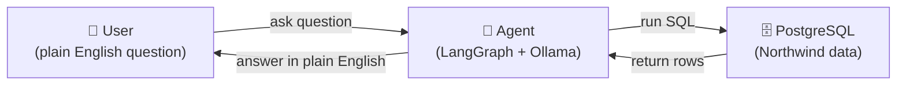
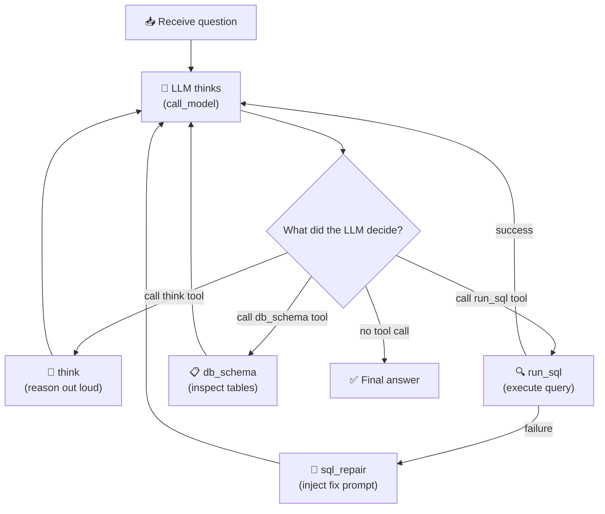

# Architecture

## What Is This?

A chatbot that answers plain-English questions about a database. You ask something like *"Who are the top 5 customers?"* and the agent figures out the SQL, runs it, and gives you a human-readable answer.

---

## The Big Picture



Three technologies power this:

| Technology | Role |
|---|---|
| **Ollama** | The local LLM — reads your question, writes SQL, produces the final answer |
| **LangGraph** | Manages the workflow — decides what to do next at each step |
| **PostgreSQL** | Stores the Northwind sample data the agent queries |

---

## How the Agent Is Structured

The agent is not a single function. It is a **graph** — a set of nodes (steps) connected by edges (decisions).



Every time the LLM finishes thinking, the graph asks: *"Does the LLM want to use a tool?"*
- Yes → run the tool, feed result back to LLM
- No → we're done, return the answer

---

## Assignment Requirements — Where Each Is Met

| Requirement | Where |
|---|---|
| LangGraph ReAct agent | `library/agent/graph_factory.py` |
| `run_sql` tool | `library/tools/db_query.py` |
| `think` tool | `library/tools/think.py` |
| Multi-turn memory (`MemorySaver`) | `graph_factory.py` — passed to `builder.compile()` |
| `think → run_sql` ordering trace | Notebook Case 6, verified by `tracing.py` |
| Northwind database | `Dockerfile.postgres` + `northwind.sql` |
| Readable notebook | `week-01/week-01.ipynb` — Cases 1–7 |

---

## Code Layout

```
library/
├── agent/          → graph, nodes, routing logic, memory
├── tools/          → think, run_sql, db_schema handlers
├── db/             → SQL safety guard + query executor
├── registry/       → tool registration (the graph reads this)
├── api/            → public types: events, service interface
├── model/          → Ollama client with fallback
├── session/        → ownership check (who owns which thread)
└── config/         → settings read from .env
```

---

## Key Design Decisions

**Why a graph instead of a simple loop?**
LangGraph makes the control flow explicit and inspectable. Each node is a named step; each edge is a visible decision. Adding a new tool means adding one entry to the registry — the graph wires itself.

**Why typed events instead of raw strings?**
The agent returns structured objects (`ThinkingEvent`, `DbResultEvent`, `AssistantTextEvent`). Callers can pattern-match on `event.type` without parsing text, and a future web UI can consume the same objects as the notebook.

**Why validate SQL before opening a database connection?**
The safety guard (`sql_guard`) rejects dangerous queries synchronously, before any connection is opened. A blocked query never touches the database — fast and safe.

**Why in-memory checkpointing (`MemorySaver`)?**
Assignment constraint: no external persistence. `MemorySaver` keeps all conversation history in a Python dict. It resets when the kernel restarts — simple, zero-config, no leakage.
