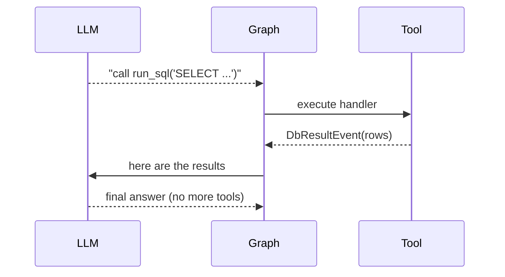
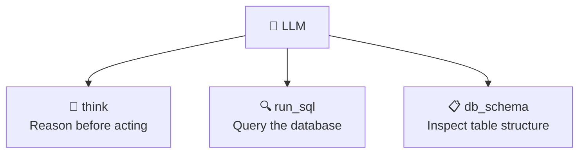
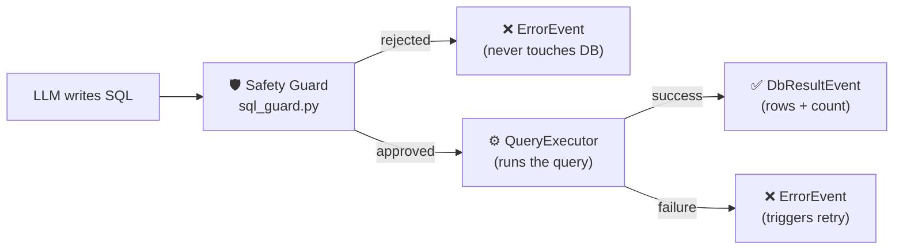
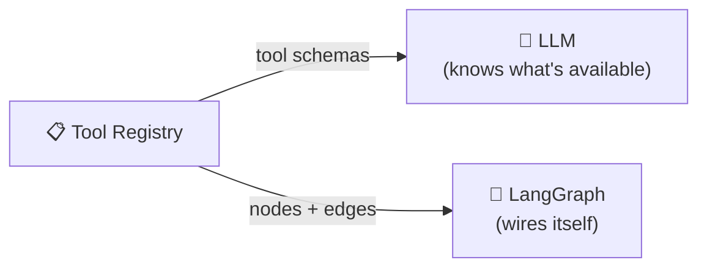

# Tools

## What Is a Tool?

A tool is an **action the LLM can take**. Without tools, the LLM can only produce text. With tools, it can look things up, run queries, and interact with the real world.

When the LLM wants to use a tool, it says *"I want to call X with these arguments."* The graph executes it and feeds the result back — then the LLM decides what to do next.



---

## The Three Tools



---

### `think` — Reason Before Acting

**Why it exists:** small local models (like Qwen or LLaMA) don't have a built-in reasoning step. Without one, they can jump straight to writing SQL and get it wrong. The `think` tool forces the model to write down its reasoning first.

**How it works:** the LLM calls `think("I should check the schema before writing the join...")`. The tool echoes it back as a `ThinkingEvent`. No side effects — it is just a named slot to externalise thought.

```
think("I need to join orders and order_details...")
  → ThinkingEvent(content="I need to join orders...")
```

**In the notebook:** Case 5 shows the raw output. Case 6 proves `think` fires *before* `run_sql`.

---

### `run_sql` — Execute a Database Query

**Why it exists:** this is the core requirement — let the LLM query the Northwind database.

**How it works:** the LLM provides a `SELECT` statement. Before it reaches the database, it passes through a safety guard.



**The safety guard checks:**
- Is it a `SELECT`? (no `DELETE`, `DROP`, `INSERT` allowed)
- No semicolons? (prevents multi-statement injection)
- No dangerous keywords? (`TRUNCATE`, `ALTER`, etc.)

A rejected query never opens a database connection — it fails fast and safe.

---

### `db_schema` — Inspect Table Structure

**Why it exists:** the LLM does not know the database schema ahead of time. Before writing SQL, it needs to know: what tables exist? what are the column names?

**How it works:** calls `information_schema` and returns formatted metadata. The LLM calls this first, then uses what it learned to write accurate SQL.

```
db_schema("orders")
  → "Table: orders\n  - order_id (integer)\n  - customer_id (varchar)\n  ..."
```

---

## How Tools Are Registered

All tools are registered in one place: `library/registry/builtin_tools.py`. The graph reads this registry at startup and automatically:

- Tells the LLM which tools exist (and what parameters they take)
- Creates a node for each tool
- Wires the routing edges

**Adding a new tool requires zero changes to the graph.**



---

## Adding a New Tool (4 Steps)

**Step 1 — Write the handler** (`library/tools/my_tool.py`):

```python
class MyToolHandler:
    async def handle(self, executor, *, my_param: str):
        return AssistantTextEvent(content=f"Result: {my_param}")
```

**Step 2 — Write the schema** (tells the LLM what the tool does and what it takes):

```python
class MyTool(BaseTool):
    name: str = "my_tool"
    description: str = "One sentence the LLM reads to decide when to call this."
    args_schema: type[BaseModel] = MyToolInput
```

**Step 3 — Register it** (`library/registry/builtin_tools.py`):

```python
tool_registry.register(ToolRegistration(
    name="my_tool",
    handler_class=MyToolHandler,
    schema=MyTool(),
    node_name="my_tool_node",
    has_retry=False,
))
```

**Step 4 — Done.** On the next `create_graph()` call, the LLM sees the new tool, a node is created for it, and it is wired into the graph automatically.

---

## Verifying Tool Call Order

`library/agent/tracing.py` lets you inspect which tools were called in the current turn:

```python
from library.agent.tracing import current_turn_tool_call_names

call_sequence = current_turn_tool_call_names(state)
# → ['think', 'db_schema', 'run_sql']
```

Used in notebook Case 6 to verify the `think → run_sql` ordering requirement.
